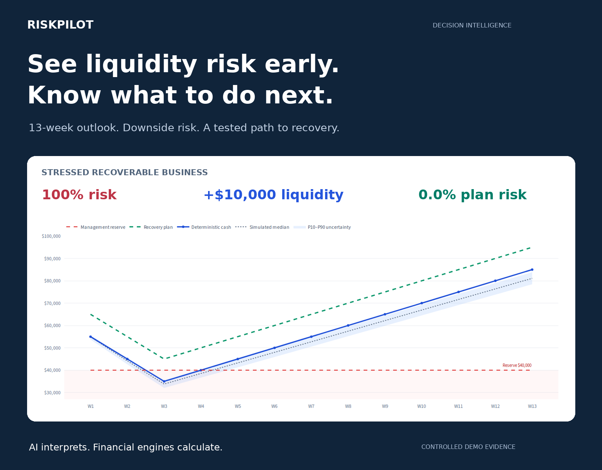
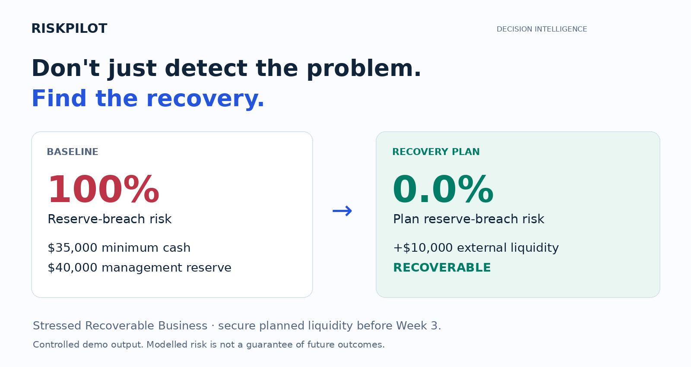
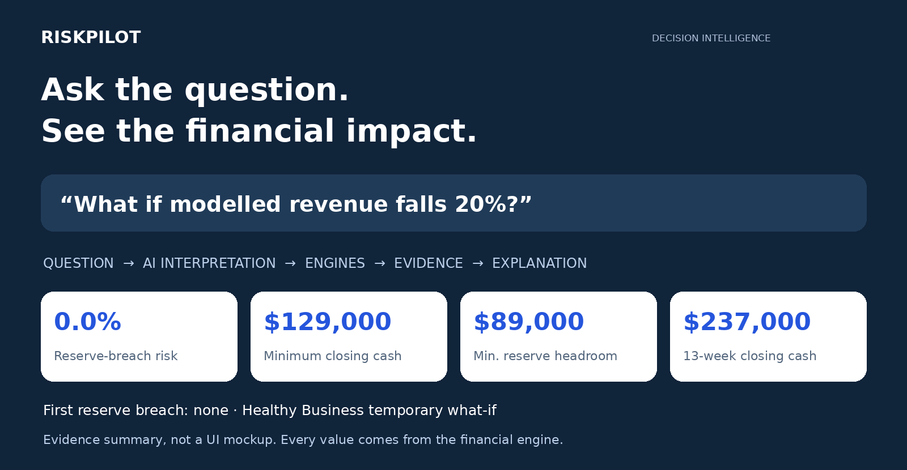
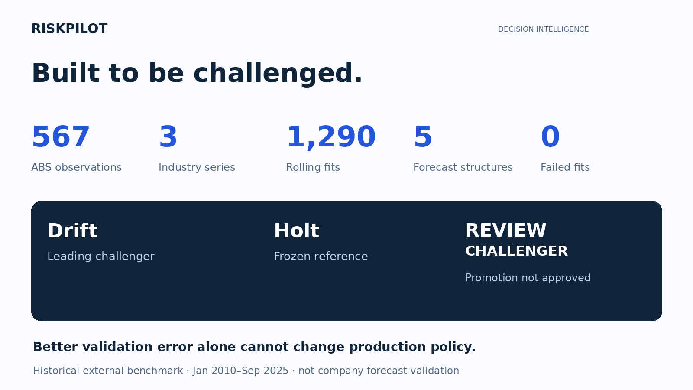
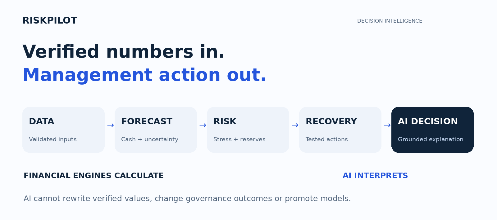
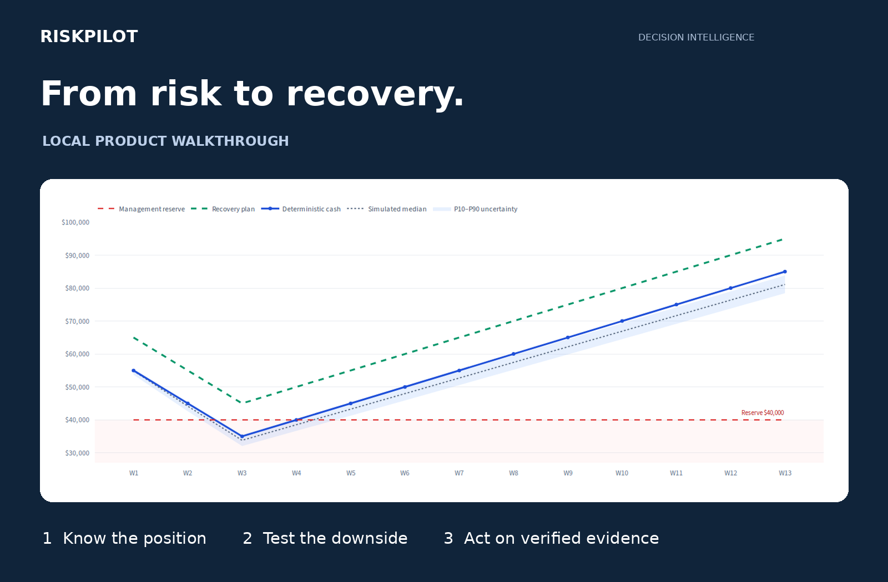

# RiskPilot

**AI Liquidity Decision Intelligence · for founders, CFOs and finance teams**

## See liquidity risk early. Know what to do next.

RiskPilot turns financial evidence into a verified **13-week liquidity outlook**, quantifies downside risk, tests recovery actions, and explains the next move with grounded AI.



**AI interprets. Financial engines calculate.**

| 567 | 1,290 | 525 | 3 | Live AI |
|---|---|---|---|---|
| Official ABS observations | Rolling validation fits | Tests passed at verified freeze | Controlled demo scenarios | Verified locally by project owner |

These are development and validation evidence, not customer counts or production usage. Live OpenAI verification is owner-reported; the archived audit records offline and mocked integration checks.

[Explore the decision flow](#know--test--act) · [Run the local demo](#demo--run-locally) · [Review the evidence](#technical-validation)

## The gap between a forecast and a decision

A cash forecast tells management what may happen. It often leaves the harder questions unanswered: **Is the downside acceptable? What breaks first? What action restores the position?**

RiskPilot connects the liquidity outlook to a tested recovery plan and a clear next action.

## Know → Test → Act

| KNOW | TEST | ACT |
|---|---|---|
| **See the liquidity position.** | **Ask “what if?” before reality does.** | **Move from risk to recovery.** |
| Read the 13-week cash trajectory, reserve risk and P10–P90 uncertainty together. | Change supported assumptions and recalculate the verified financial impact in a temporary scenario. | Test recovery actions, quantify required buffers and turn evidence into management actions and monitoring triggers. |

## Risk → Recovery

**Don't just detect the problem. Find the recovery.**

In the **Stressed Recoverable Business** demo, minimum projected cash falls to **$35,000**, below the **$40,000** management reserve. The tested plan adds **$10,000** of external liquidity and reduces modelled reserve-breach risk from **100% to 0.0%**.



The next action is specific: **secure the planned liquidity before Week 3**. These are controlled demo outputs under the modelled assumptions; 0.0% simulated risk is not a guarantee of future outcomes.

## AI what-if

**Ask the question. See the financial impact.**

> What if modelled revenue falls 20%?

RiskPilot AI interprets the supported request. The financial engines recalculate the temporary scenario. AI explains the verified outcome while the baseline remains isolated and can be restored.



Every financial value comes from the verified financial engine. **AI cannot replace verified values, change governance outcomes or promote models.** This is AI embedded in a decision workflow: interpret, orchestrate, explain, act.

## Trusted intelligence / real-data validation

**Built to be challenged.**



The frozen external benchmark covers **January 2010–September 2025**, with **189 observations per industry**. Drift is the leading external challenger; Holt remains the frozen governance reference. The outcome is **REVIEW CHALLENGER** and production promotion is **NOT APPROVED**.

Better validation error alone is not enough to change production policy. AI explains the evidence; governance controls promotion.

**Scope matters:** ABS data is an external monthly model benchmark, not demo-company revenue. It never enters the V2 13-week cash engine and does not validate a company-specific forecast. The three industry series share economic shocks and are not statistically independent.

## How RiskPilot works



Financial evidence → input validation → forecast and uncertainty engines → liquidity risk and stress / reverse stress → recovery optimisation → verified decision evidence → grounded AI interpretation → management action.

| Workspace | Decision it supports |
|---|---|
| **Command Center** | Understand the 13-week position, inspect recovery, ask a temporary what-if and monitor action triggers across three controlled demo scenarios. |
| **Advanced Analytics** | Explore separate monthly business forecasts, liquidity risk, stress testing and monthly analysis; inspect the external benchmark in Forecast Intelligence. |
| **Methodology & Evidence** | Review input diagnostics and the verified financial-to-AI decision architecture. |

## Demo / run locally



The demo runs locally. Start with **Stressed Recoverable Business**, inspect the cash outlook, open **Recovery**, and review **Actions & Monitoring**. Then switch to **Healthy Business** and ask the temporary revenue-decline question above. **Severe Uncertain Business** demonstrates a harder downside case.

```bash
git clone https://github.com/Jlawnat/forgehacks-riskpilot.git
cd forgehacks-riskpilot
python -m venv .venv
source .venv/bin/activate
python -m pip install -r requirements-verified.txt
python -m streamlit run app.py
```

On Windows PowerShell, activate with `.venv\Scripts\Activate.ps1` instead. Python 3.12 was used at the verified freeze.

The application works without an AI key using deterministic evidence summaries. Configure `OPENAI_API_KEY` locally for generative explanations; never commit credentials. `RISKPILOT_AI_MODEL` controls the existing model selection. Live service behavior depends on the configured account and model. No hosted demo or recorded video is claimed here.

## Technical validation

The archived freeze records **525 tests passed**, successful `compileall` and `git diff --check`, and **1,290 benchmark fits with zero failed or captured-warning windows**. This presentation pass does not rerun or regenerate frozen numerical evidence.

[Full external benchmark, source provenance and both horizon tables](docs/validation/REAL_DATA_BENCHMARK.md) · [Archived V2M verification and known limits](docs/engineering/FINAL_V2M_AUDIT.md) · [Original application QA screenshots](docs/visual_qa/) · [Marketing asset provenance](docs/marketing/README.md)

<details>
<summary><strong>Exact primary-horizon scores and governance controls</strong></summary>

Three-month horizon; equal-weight industries. MAE and RMSE are in **index points**, not dollars. Values below retain the archived six-decimal presentation.

| Model | MAE | RMSE | MASE |
|---|---:|---:|---:|
| Drift | 2.769328 | 5.200863 | 1.893347 |
| Holt | 2.829568 | 5.606079 | 1.910892 |
| Damped Holt | 2.913522 | 5.628728 | 1.976179 |
| Naive | 2.937468 | 5.281742 | 2.004068 |
| SES | 2.993224 | 5.483981 | 2.030125 |

Drift improves three-month MAE versus Holt by 2.1289% and wins 45.7364% of windows, failing the required 5% improvement and 55% win thresholds. Damped Holt has not been promoted either.

Holt is the **frozen governance reference**, not a universal fixed forecast for every input. The existing monthly selector may choose approved Holt or Naive alternatives using validation. No external challenger changes that policy. AI can neither change the outcome nor authorize promotion.

</details>

<details>
<summary><strong>Benchmark methodology and reproduction</strong></summary>

Official ABS Monthly Business Turnover Indicator: Retail trade, Accommodation and food services, and Professional, scientific and technical services. Five structures: Naive, Drift, SES, Holt and Damped Holt.

Expanding rolling-origin validation starts with 60 training months and advances every three months. Each series has 43 origins at each of the one- and three-month horizons. Fitting and MASE scaling use only the training prefix. Industries receive equal aggregate weight; failures remain in planned-window counts. Fit warnings, predictions, actuals and provenance are retained in frozen evidence.

The final ABS data vintage includes revisions and concurrent seasonal adjustment. Prefix-only fitting within that vintage does **not** recreate information available in real time at historical origins. Publication ceased after September 2025.

From the repository root, the archived reproduction commands are:

```bash
python scripts/import_abs_benchmark.py
OPENBLAS_NUM_THREADS=1 OMP_NUM_THREADS=1 python -m scripts.run_external_benchmark
python -m compileall -q .
git diff --check
OPENBLAS_NUM_THREADS=1 OMP_NUM_THREADS=1 python -m pytest -q
```

The import defaults to frozen official XLSX files. `--fetch` explicitly downloads the pinned release. Tests need no internet. **Regenerating evidence resets regression and promotion approvals and requires re-verification**; do not copy old approvals onto new results.

`requirements-verified.txt` records the direct dependency versions used for verification; it is not a complete transitive lockfile. The original `requirements.txt` remains available with its local editable path repaired.

</details>

**Limits:** controlled demo scenarios are not customer deployments. Historical industry indexes do not establish company forecast accuracy. The model comparisons and eligibility thresholds are descriptive, not significance tests; COVID shocks affect RMSE. Monthly benchmark horizons do not validate the separate weekly cash architecture. Existing interval and simulation limits remain in force. The archived audit used mocked AI integration checks; owner-reported local live verification is a separate claim, not a reproducible CI result. Consult the linked evidence before making deployment or promotion decisions.

## ForgeHacks 2026 development scope

RiskPilot includes financial-analysis foundations developed across the broader project lifecycle. The submission distinguishes those foundations from the work that developed the current decision-intelligence product.

<details>
<summary><strong>Competition development scope</strong></summary>

Major work for ForgeHacks 2026 includes:

- V2 13-week Liquidity Command Center and deterministic / probabilistic risk presentation.
- Recovery, management actions, monitoring triggers and verified decision evidence.
- Grounded AI support and engine-backed temporary what-if orchestration.
- Forecast-model governance, the official ABS external benchmark and AI governance supervision.
- Verified decision architecture, UI, reliability and regression hardening.

The submission does not claim ABS indexes are the demo company's historical revenue, or that the LLM independently calculates financial values. No new financial or AI runtime behavior is introduced by this GitHub presentation pass.

</details>
