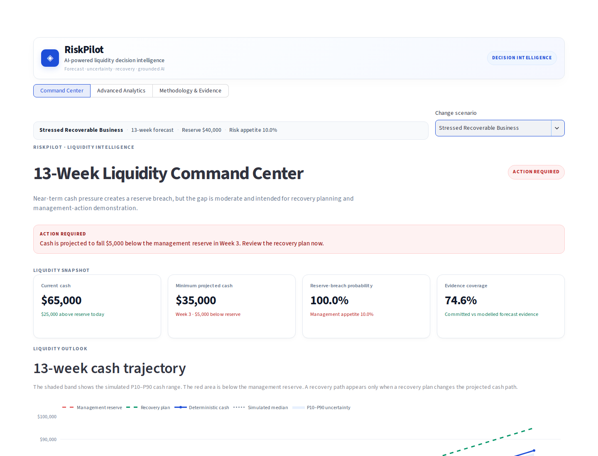
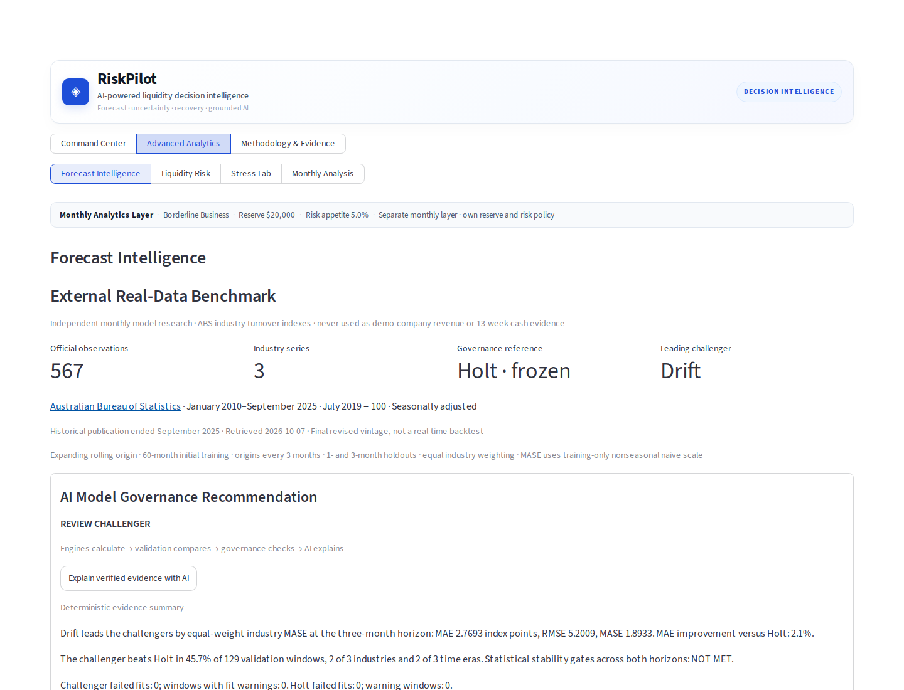
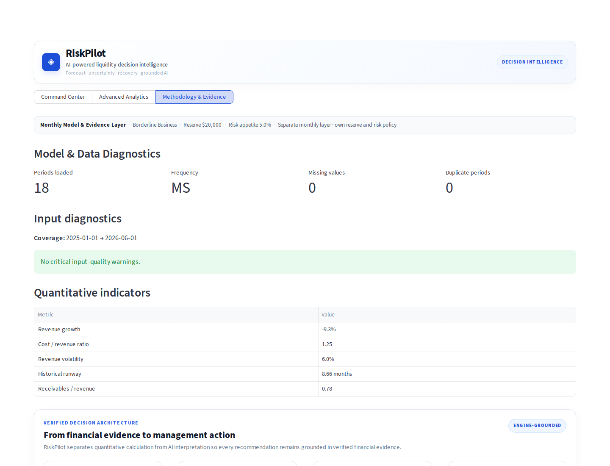

# RiskPilot

## Engine-grounded AI for liquidity decisions

**RiskPilot turns financial evidence into verified 13-week cash forecasts, probabilistic liquidity risk, recovery actions, and grounded AI recommendations.**

Instead of asking an LLM to guess financial numbers, RiskPilot separates calculation from interpretation:

**Financial engines calculate → validation checks → structured evidence → AI interprets → management acts**

RiskPilot is designed for founders, CFOs and finance teams who need to answer:

> **Do we need to act now — and if so, what should we do?**

### Core capabilities

- 13-week cash and liquidity forecasting
- reserve-breach probability and uncertainty ranges
- stress testing and recovery planning
- management actions and monitoring triggers
- natural-language temporary what-if analysis
- verified AI explanations
- external real-data forecasting benchmark
- AI-supervised model governance



## Why the AI matters

RiskPilot does **not** ask an LLM to invent financial forecasts.

The quantitative engines remain the source of truth.

RiskPilot AI is used for:

- interpreting management questions
- orchestrating supported temporary what-if scenarios
- explaining verified liquidity and risk evidence
- translating engine outputs into management actions
- supervising forecast-model governance without being allowed to change production policy

AI cannot silently replace verified financial values, alter governance outcomes, or promote a forecasting model.

### Example: engine-backed temporary what-if

A user can ask:

> **What if modelled revenue falls 20%?**

RiskPilot interprets the request, applies it only as a temporary scenario, reruns the relevant 13-week engines and returns verified evidence.

In the current Healthy Business demo, that scenario produces:

- reserve-breach risk: **0.0%**
- minimum closing cash: **$129,000**
- minimum reserve headroom: **$89,000**
- 13-week closing cash: **$237,000**
- first reserve breach: **none**

The baseline scenario remains isolated and can be restored after the what-if.

## Run

Use your existing verified environment, or create an isolated environment:

```bash
python -m venv .venv
source .venv/bin/activate
python -m pip install -r requirements-verified.txt
python -m streamlit run app.py
```

The application works without an AI key. Configure `OPENAI_API_KEY` locally to use generative explanations. Do not commit credentials. `RISKPILOT_AI_MODEL` controls the existing AI model selection.

## Workspaces

- **Command Center:** three controlled demo scenarios; deterministic and uncertain 13-week cash trajectories, verified evidence, recovery, management actions, monitoring and temporary what-if analysis.
- **Advanced Analytics:** separate monthly business forecasts, liquidity risk, stress lab and monthly business analysis. Forecast Intelligence includes the clearly labelled external model benchmark.
- **Methodology & Evidence:** current monthly input diagnostics and verified financial-to-AI decision architecture.

## V2M external benchmark

567 official ABS monthly observations across Retail trade, Accommodation and food services, and Professional, scientific and technical services. Frozen January 2010–September 2025 data; publication ceased. Five existing models, two forecast horizons, 1,290 rolling validation fits. Industry index data never becomes demo-company revenue or V2 cash evidence.

The current conclusion is **REVIEW CHALLENGER**: retain the approved production policy and review Drift. Damped Holt does not qualify for promotion. AI consumes structured verified metrics and prioritizes approved explanatory claims; it cannot calculate replacements or switch production. The deterministic summary remains available without a generative service.

See [REAL_DATA_BENCHMARK.md](REAL_DATA_BENCHMARK.md) for exact results, methodology, source URLs, reproduction and limitations. See [FINAL_V2M_AUDIT.md](FINAL_V2M_AUDIT.md) for release checks and known limits.

## Forecast model governance

RiskPilot evaluates five transparent forecasting structures: Naive, Drift, SES, Holt and Damped Holt.

The external ABS benchmark uses expanding rolling-origin validation across three industries.

At the primary three-month horizon:

| Model | MAE | RMSE | MASE |
|---|---:|---:|---:|
| Drift | 2.7693 | 5.2009 | 1.8933 |
| Holt | 2.8296 | 5.6061 | 1.9109 |
| Damped Holt | 2.9135 | 5.6287 | 1.9762 |
| Naive | 2.9375 | 5.2817 | 2.0041 |
| SES | 2.9932 | 5.4840 | 2.0301 |

Drift is the strongest external challenger on aggregate three-month MAE, but it does not satisfy the required stability gates.

> **REVIEW CHALLENGER — retain the current production policy.**

Lower validation error alone never authorizes promotion. RiskPilot AI can explain verified governance evidence, but it cannot change verified metrics, governance outcomes or production model selection.



## Verified decision architecture

RiskPilot deliberately separates quantitative calculation from AI interpretation:

Financial evidence → Input validation → Forecast & uncertainty engines → Liquidity risk & stress testing → Recovery optimisation → Verified decision evidence → RiskPilot AI → Management action

The product presents this as:

**Data Foundation → Forecast & Uncertainty → Risk & Resilience → Recovery & Decision → AI Decision Layer**

This separation is central to RiskPilot: the AI explains and orchestrates verified evidence rather than inventing financial numbers.



## ForgeHacks 2026 development scope

RiskPilot contains financial-analysis foundations developed across the broader project lifecycle.

For ForgeHacks 2026, the project was developed into the current decision-intelligence product with major work including:

- the V2 13-week Liquidity Command Center
- deterministic and probabilistic liquidity-risk presentation
- recovery and management-action workflows
- verified evidence and monitoring triggers
- grounded RiskPilot AI decision support
- engine-backed temporary what-if orchestration
- forecast model governance
- the official ABS external forecasting benchmark
- AI model-governance supervision
- verified decision architecture
- final UI, reliability and regression hardening

The submission does not claim that ABS industry indexes are the historical revenue of the demo company.

It also does not claim that the LLM independently calculates financial values.

> **Financial engines calculate. RiskPilot AI interprets verified evidence.**

## Verify and reproduce offline

```bash
python scripts/import_abs_benchmark.py
OPENBLAS_NUM_THREADS=1 OMP_NUM_THREADS=1 python -m scripts.run_external_benchmark
python -m compileall -q .
git diff --check
OPENBLAS_NUM_THREADS=1 OMP_NUM_THREADS=1 python -m pytest -q
```

`--fetch` on the import script explicitly downloads the pinned official ABS release. No tests need internet access. Rebuilding evidence resets its regression/promotion approvals and requires re-verification.

The original `requirements.txt` is retained with its local editable path repaired. `requirements-verified.txt` records the direct dependency versions actually used in this verification; it is not a complete transitive lockfile.
