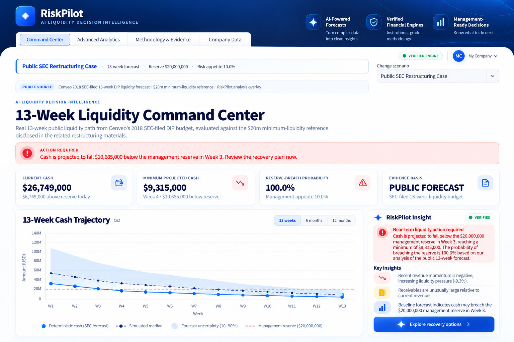
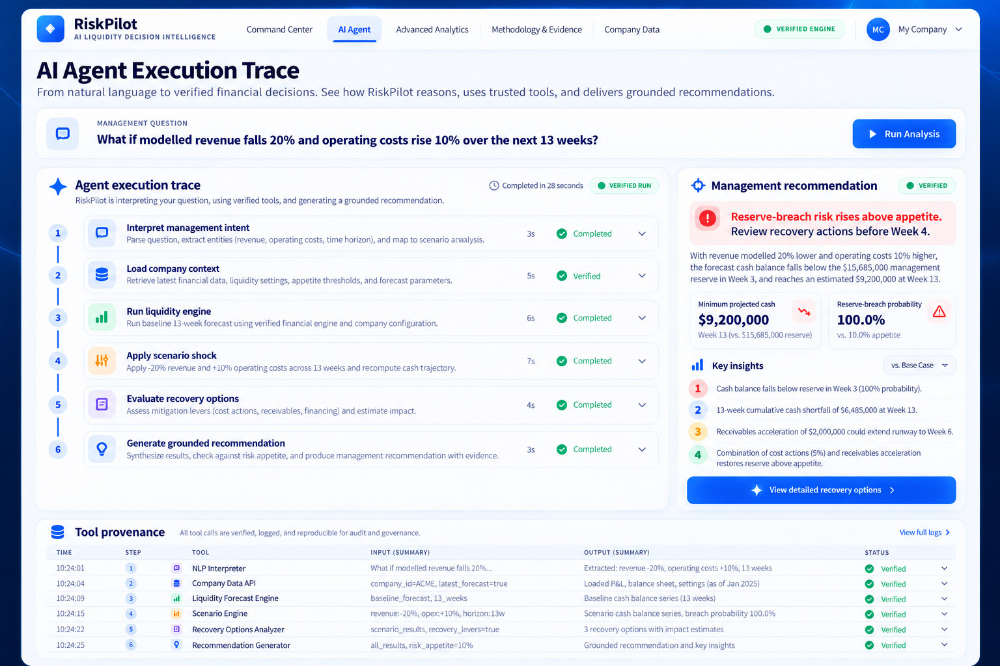
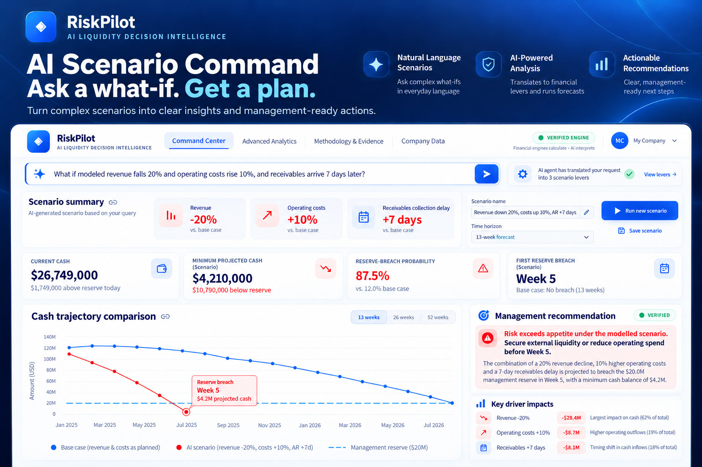
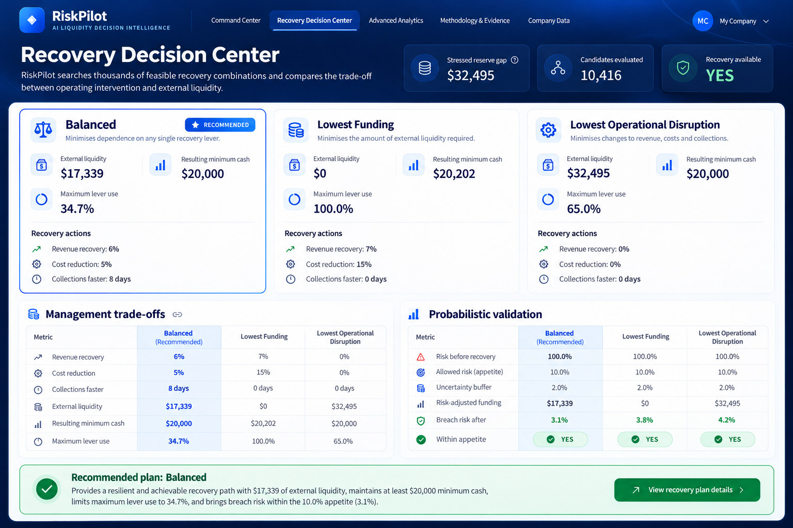
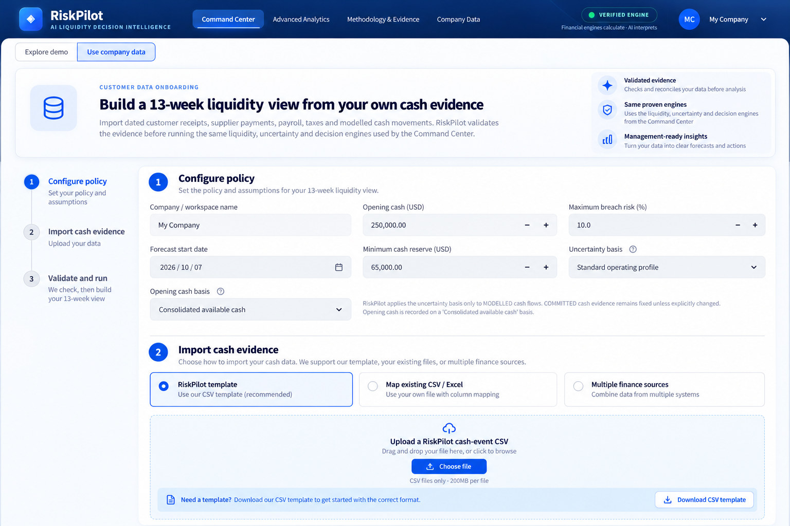
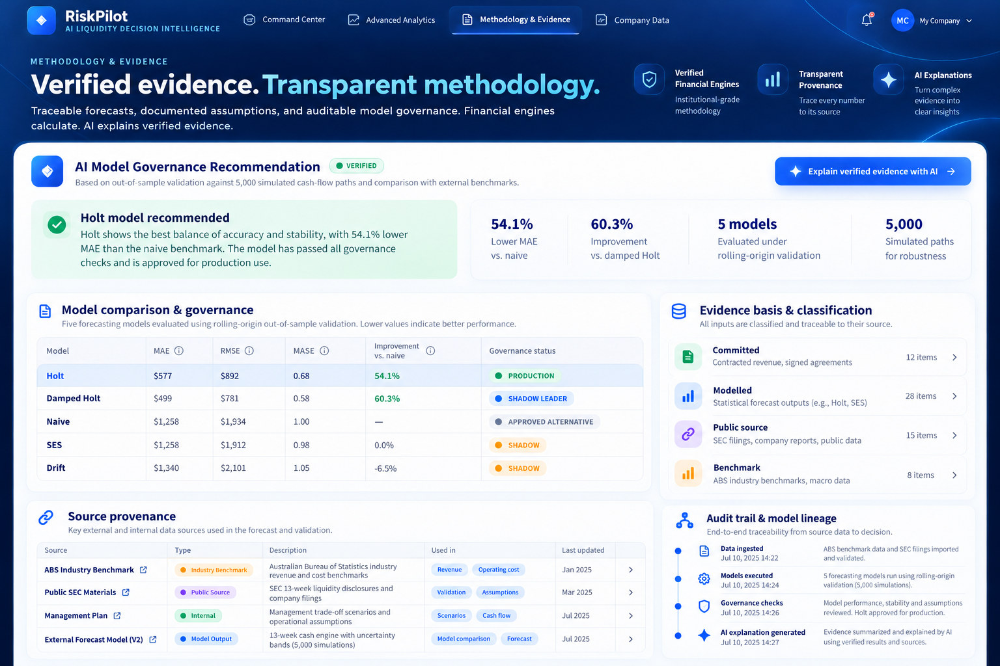

# RiskPilot — Approved Premium Frontend Design References

> **Design concept gallery — not a verified runtime screenshot collection.** These images are approved visual targets for the React/Vite premium frontend. They may depict illustrative metrics, anticipated capabilities, alternate layouts, and model decisions that are **not** the outputs of RiskPilot's financial engines. Do not cite their numeric values as simulation results, validation evidence, or production claims. Current product functionality must be verified against the running React frontend and Python API.

## Design direction

The approved direction uses a dark-navy gradient shell, restrained electric-blue and cyan accents, generous whitespace, legible KPI cards, clean chart typography, accessible action states, consistent hierarchy, and clear paths from evidence to management decisions.

The references guide **presentation and UX only**. They do not authorize modifications to engine calculations, evidence classes, API contracts, forecast horizons, probabilistic results, governance logic, or AI safety boundaries.

## Reference gallery

### 1. 13-week Liquidity Command Center

Target experience: authoritative data context, 13-week cash and uncertainty, reserve policy, actionable management insight. Longer horizons must be shown only if a validated engine result is available.

### 2. AI Agent Execution Trace

Target experience: natural-language question, observable tool execution, source provenance, grounded recommendation. Display only actual runtime actions and timings. Never imply access to private model reasoning or fabricate tool calls.

### 3. AI Scenario Command

Target experience: management what-if question, supported inputs, temporary scenario result and baseline comparison. The 13-week engine supports only verified scenario levers; unsupported collection timing and extended horizons must not be manufactured.

### 4. Recovery Decision Center

Target experience: explainable recovery alternatives, financing-versus-intervention trade-offs and separately calculated probabilistic validation. Only show feasible plans supplied by the active recovery model and its constraints.

### 5. Company Data

Target experience: upload customer cash evidence, map CSV/Excel fields, validate classification and provenance, then apply the same verified 13-week financial engines. Uploaded company data is distinct from synthetic demonstrations and SEC public source analysis.

### 6. Methodology & Evidence

Target experience: source traceability, forecast methodology and auditable AI/financial boundaries. The figures in this concept, including model rankings, dates, sample sizes and governance badges, are **illustrative design content**, not current approved test results.

## Current implementation and evidence

- React/Vite frontend: `web/`
- Python API adapter: `src/api/premium_web.py`
- Existing financial and AI engines: retained; do not replace with frontend formulas
- Start local premium app: `bash scripts/run_premium_web.sh`
- Frontend: <http://localhost:5173>
- API: <http://127.0.0.1:8000>
- Frozen independent benchmark evidence: [Technical validation](../../README.md#technical-validation)

For a reviewer-facing product demo, prefer **actual screenshots of the running premium app** and cite the active dataset, simulation scope, and model provenance. Use this gallery only to illustrate the approved visual design direction.
